# conceptmod 2.0

**Finetuning with words**, rebuilt for the flow-matching era.

A DSL for editing concepts directly into (and out of) text-to-image diffusion
models, using only the model's own learned representations — no datasets, no
example images. This is a modernization of
[ntc-ai/conceptmod](https://github.com/ntc-ai/conceptmod) (2023, CompVis-era
Stable Diffusion) targeting current flow-matching DiT models via
🤗 diffusers + transformers + peft:

* **SANA 0.6B** (`Efficient-Large-Model/Sana_600M_512px_diffusers`) — default;
  small and fast enough to prove every operator in minutes
* **Z-Image Turbo 6B** (`Tongyi-MAI/Z-Image-Turbo`) — 2026-class model, LoRA training
* **Anima 2B** (`circlestone-labs/Anima-Base-v1.0-Diffusers`) — anime Cosmos-Predict2 DiT, LoRA training
* **Krea 2 Raw 12B** (`krea/Krea-2-Raw`) — 2026 single-stream MMDiT, LoRA training
  (train on Raw; Turbo is the 8-step distilled sibling)
* **SenseNova-U1.5-8B-MoT** (`sensenova/SenseNova-U1.5-8B-MoT`) — 17.5B NEO-unify
  any-to-any LLM, LoRA training. No VAE and no diffusers pipeline: flow matching
  runs on raw pixels and the text encoder *is* the denoiser (see Tuning notes).
  Needs the `sensenova-u1` package (branch `feat/u1.5`), not on PyPI.

The phrase to start with is the original-repo example — freeze the empty
prompt, write robot into human, lightly align so the swap holds:

```bash
python train.py --phrase "#:0.4|human=robot:0.8|robot%human:-0.1" \
    --out outputs/my_run \
    --verify-prompt "a human walking in a city" \
    --verify-prompt "a portrait of a human" \
    --verify-prompt "a bowl of fruit on a table"
```

Every velocity-space loss operates on the classifier-free-guidance geometry
`v(z,t,c) − v(z,t,'')` — the same translation used by modern concept-erasure
work on rectified-flow transformers (EraseAnything ICML'25, GEM '26), which is
what the original did with UNet noise predictions.

<p align="center">
  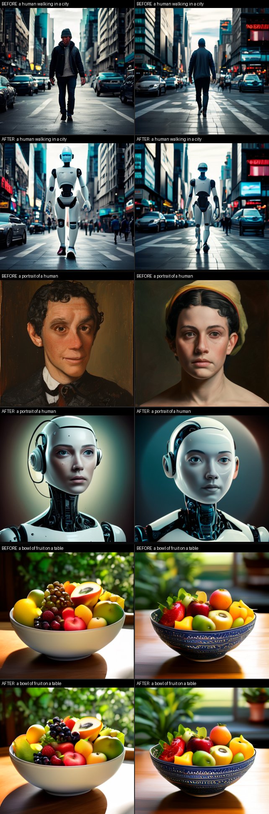
</p>
<p align="center"><em>The goto proof: <code>#:0.4|human=robot:0.8|robot%human:-0.1</code> on SANA 0.6B. Left is frozen, right is trained. Fruit is the control.</em></p>

## Proofs

Each operator has a fixed-seed before/after grid in `outputs/NN_<op>/grid.png`.
**Left is the frozen model, right is the trained model**, same prompt and seed.
Teal **CONTROL** rows are an unrelated fruit-bowl prompt — the edit should
leave them alone (that is how you see collateral damage).

All 13 SANA proofs were audited by independent multi-agent judge rounds and
iterated (earlier rounds kept as `grid_v*.png`) until every op reached a
**pass** verdict. ~5–25 min each on one RTX A6000.

**Start here:** [Composite](#12-composite) — then
[Exaggerate](#01-exaggerate) ·
[Erase](#02-erase) ·
[Write ∅](#03-write-uncond) ·
[Write](#04-write) ·
[Freeze](#05-freeze) ·
[Blend](#06-blend) ·
[Orthogonal](#07-orthogonal) ·
[Replace](#08-replace) ·
[Encoder](#09-encoder-stage) ·
[Random prompt](#10-random-prompt) ·
[Pixel](#11-pixel) ·
[Both stages](#13-stage-both) ·
[Z-Image ++](#21-zimage-exaggerate) ·
[Z-Image write](#22-zimage-write) ·
[Anima composite](#31-anima-composite) ·
[Anima composite + ++](#32-anima-composite-boost)

### 01 exaggerate

`vibrant colors++` (guidance 5) — globally vivid colors, structure preserved.

<p align="center">
  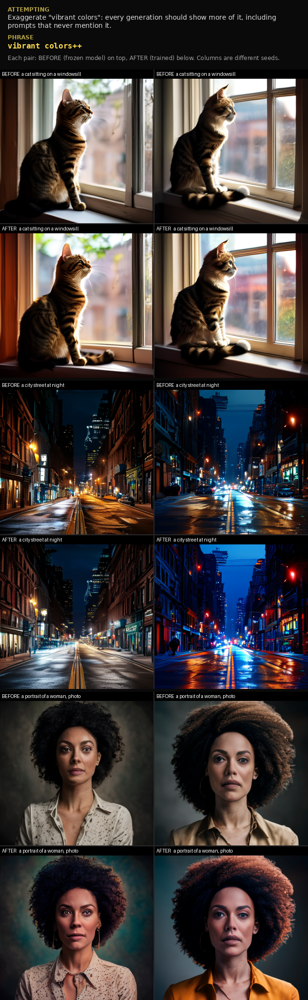
</p>

### 02 erase

`monochrome--` (800 iters) — monochrome / black-and-white / grayscale prompts
all render in color. Fruit is the control.

<p align="center">
  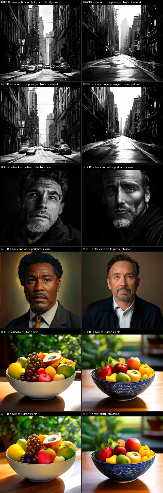
</p>

### 03 write uncond

`=snow` — empty-prompt generations become snowy scenes. Sample at low guidance
(or on turbo / CFG-free models) to see a baked-in unconditional as default
content; under CFG > 1 it behaves like a negative prompt.

<p align="center">
  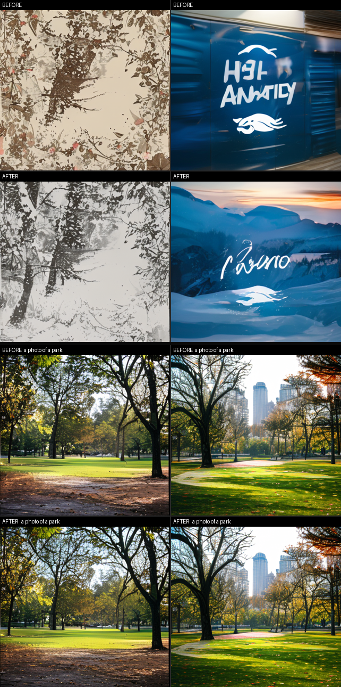
</p>

### 04 write

`cat=dog` (900 iters) — **remap only**: cat prompts produce dogs. Dog itself
is not boosted, so one windowsill seed still looks like a cat. Fruit stays
fruit. For a more thorough swap, use `~` below.

<p align="center">
  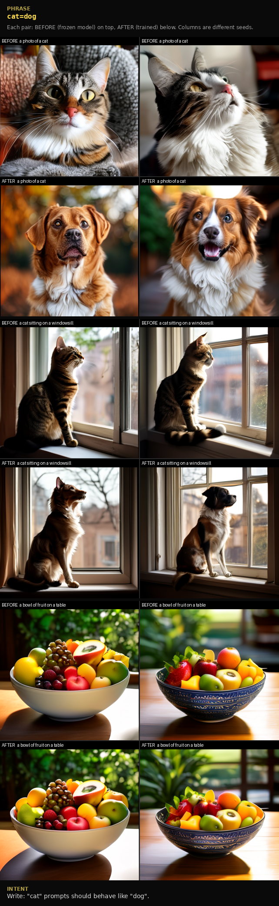
</p>

### 05 freeze

`monochrome--|a chessboard#a chessboard` — the frozen chessboard stays B&W
while B&W portraits colorize around it.

<p align="center">
  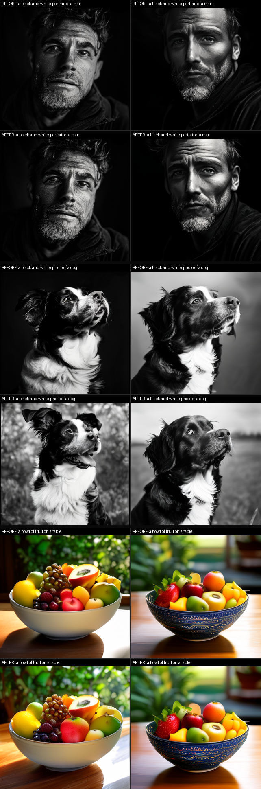
</p>

### 06 blend

`anime%hyperrealistic:-3|hyperrealistic%anime:-3` — symmetric phrase, true
two-way style convergence.

<p align="center">
  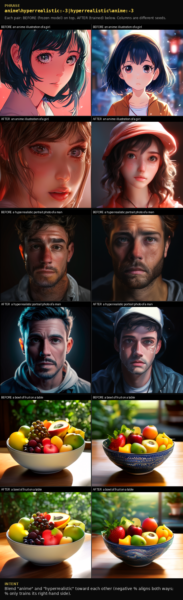
</p>

### 07 orthogonal

`cat%dog:2|cat#cat|dog#dog:0.5` — strip cat-features out of dogs. The `#`
anchors keep both concepts' anatomy intact.

<p align="center">
  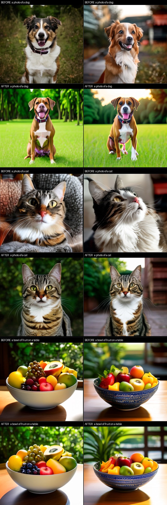
</p>

### 08 replace

`cat~dog:0.35` (900 iters) — **swap recipe**, not a fourth loss. Expands to
`dog++:0.7 | cat=dog:1.4 | dog%cat:-0.35`: turn dog up, remap cat→dog, lightly
align. Same job as `04` but it takes in every context, including the
windowsill seed write missed.

<p align="center">
  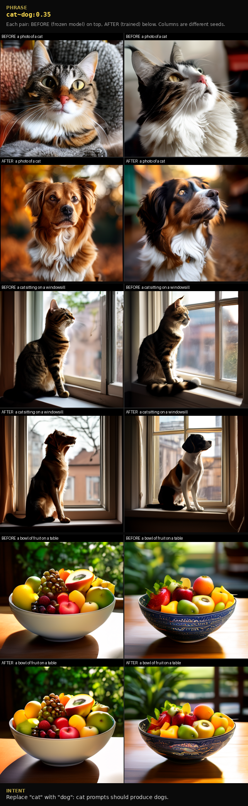
</p>

### 09 encoder stage

`--stage encoder --encoder-strength 2` — a text-encoder LoRA alone, DiT
untouched. Visible global shift before any model training.

<p align="center">
  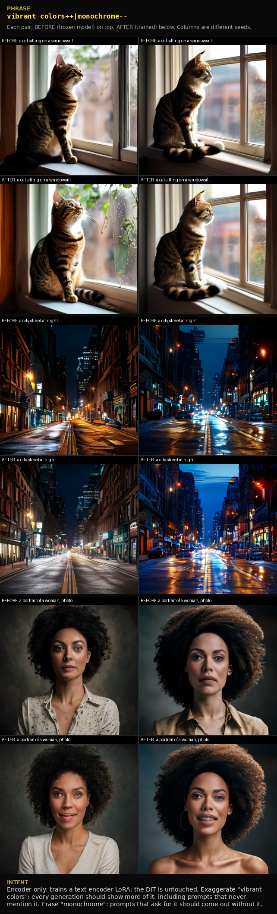
</p>

### 10 random prompt

`final boss++:0.4|final boss%{random_prompt}:-0.1` — more imposing bosses,
the rest of the model pinned by a small aligning `%` against random prompts.

<p align="center">
  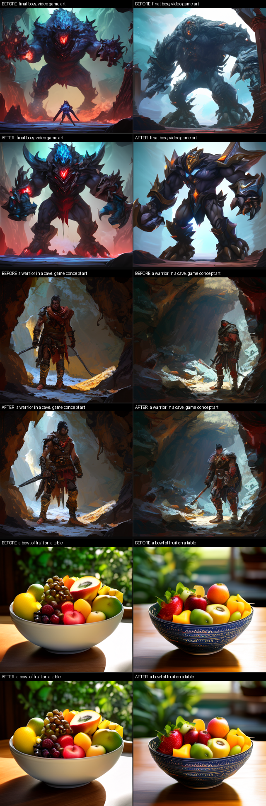
</p>

### 11 pixel

`a painting of a house^a photo of a house` (220 iters, lr 1e-5) — paintings
shift toward a photographic palette. The photo side is anchored; fruit is
the control.

<p align="center">
  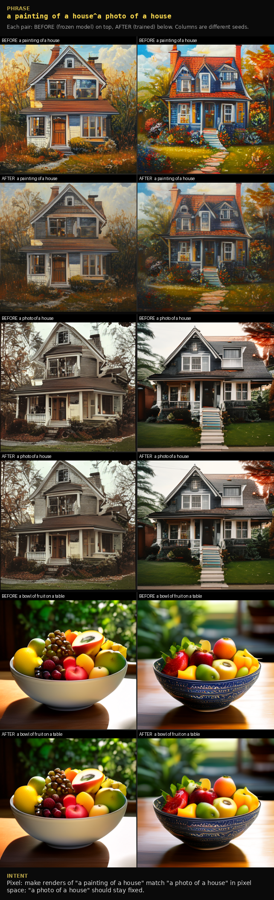
</p>

### 12 composite

**The goto example.** `#:0.4|human=robot:0.8|robot%human:-0.1` — the
original-repo phrase, three operators composed: freeze the empty prompt so
unrelated defaults stay put, write robot into human, lightly align so the
swap holds. Humans become robots; fruit stays fruit.

<p align="center">
  
</p>

### 13 stage both

`--stage both` — encoder LoRA first, then the DiT. Strongest combined effect
(`vibrant colors++|monochrome--`).

<p align="center">
  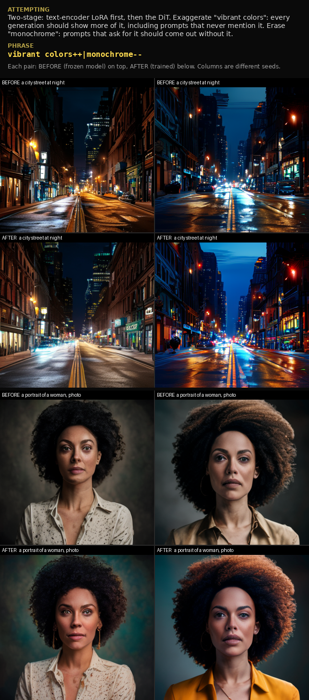
</p>

### 21 zimage exaggerate

`vibrant colors++` on Z-Image Turbo (LoRA 16) — 2026 6B model: glowing ambers,
saturated skies.

<p align="center">
  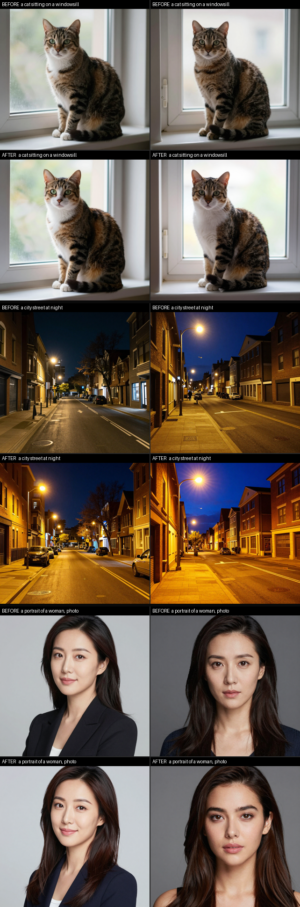
</p>

### 22 zimage write

`cat=dog` on Z-Image Turbo (LoRA 16) — complete replacement: cats render as
dogs in the same compositions. Mild drift on the fruit control; add a `#`
rule to pin what matters.

<p align="center">
  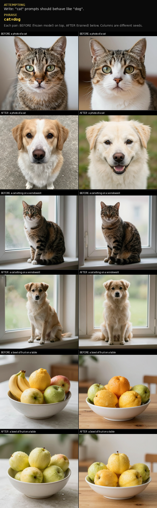
</p>

### 31 anima composite

`#:0.4|human=robot:0.8|robot%human:-0.1` on Anima Base (LoRA 16, 768px).
Portraits swap cleanly. Full-body city walks barely move — Anima's `1girl`
walk prior drowns the word `human`, and write is remap-only.

<p align="center">
  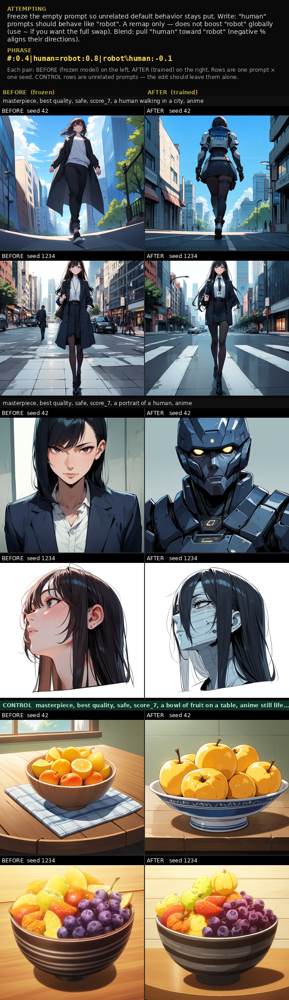
</p>

### 32 anima composite boost

Same freeze + write + align, plus `robot++:0.4`, and a walking-city write
template. The seed-42 walk becomes a full robot; seed 1234 still walks as a
person. Fruit stays fruit.

```bash
python train.py --backend anima --stage model --lora 16 \
    --phrase "#:0.4|human=robot:0.8|robot++:0.4|robot%human:-0.1" \
    --out outputs/32_anima_composite_boost
```

<p align="center">
  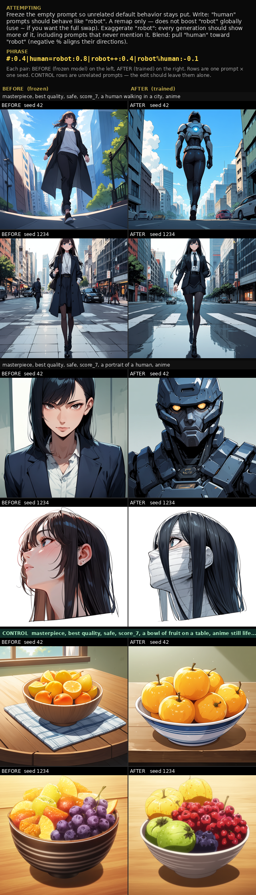
</p>

## The DSL

Rules are separated by `|`. Each rule is scaled by an optional `:alpha`.

| Syntax | Name | Effect |
|---|---|---|
| `c++` | exaggerate | more of concept `c` in **every** generation. Optional `:guidance=g` (default 3): how far past the model's own concept direction to push |
| `c--` | erase | remove concept `c` (true ESD erasure, sampled in the concept's own context) |
| `a=b` | write | **one loss**: remap prompt `a` so it behaves like concept `b`. Does not boost `b` globally. `=b` (or `b=`) writes `b` into the empty / unconditional prompt. Under CFG > 1 a baked-in unconditional acts like a negative prompt; sample at low guidance (or turbo / CFG-free) to see it as default content |
| `a#b` | freeze | pin prompt `a` to the frozen model's behavior for `b`. Bare `#` pins the unconditional. Add `#`-rules to protect things you don't want to move |
| `a%b` | orthogonal | decorrelate `b`'s concept direction from `a`'s. Negative alpha (`a%b:-1.0`) *aligns* them instead — blending |
| `a~b` | replace | **not a fourth loss** — a swap recipe that expands to `b++:0.2 \| a=b:0.4 \| b%a:-0.1` (the `:λ` on `~` scales those three). Use when a plain write does not take in every context |
| `a^b` | pixel | pixelwise L2 between full renders of `a` and `b` (gradients flow through the final sampling steps + VAE decode). Dead code in the 2023 original; implementable now that few-step flow sampling is cheap |
| `{random_prompt}` | | substituted each step with a random prompt from `Gustavosta/Stable-Diffusion-Prompts` |
| `:0.5` / `:key=v` | options | alpha scale / named op options |
| `@` | | deprecated, ignored |

**`=` vs `~`.** `cat=dog` is a single remap: cat-prompts are trained to match
dog's velocity. Dog prompts, and everything else, are left alone. `cat~dog`
is shorthand for *also* turning dog up (`++`) and lightly aligning the two
(`%` with negative alpha) so the swap generalizes. Same idea as writing
`#:0.4|human=robot:0.8|robot%human:-0.1` by hand — `~` just packages the
common swap. In the proofs, write still missed one windowsill seed; replace
did not.

The goto phrase — freeze + write + align, unchanged from the original repo
(this is a composed write, not a `~`):

```
#:0.4|human=robot:0.8|robot%human:-0.1
```

## Two-stage training

Lesson learned from
[sliders-conceptmod](https://github.com/ntc-ai/sliders-conceptmod): **train
the text encoder first; once verified, train the model.**

```bash
python train.py --phrase "..." ...                # encoder → verify → model → verify (default)
python train.py --phrase "..." --stage encoder    # notrigger-style, embedding space only
python train.py --phrase "..." --stage model      # DiT finetune only (skip the encoder)
```

* **Stage 1 (encoder)**: a LoRA on the text encoder trained purely in
  embedding space — no diffusion sampling in the loop, so it runs in seconds
  and is verified with images before any model training. This is the
  modernized "notrigger" method (pooled concept directions for LLM encoders,
  fixed-distance curriculum).
* **Stage 2 (model)**: the DiT is finetuned with the velocity-space losses.
  Default trains cross-attention weights directly (`--train-method
  xattn|selfattn|attn|full|noxattn`); `--lora RANK` trains a peft LoRA
  instead (required for Z-Image, Anima, Krea, and SenseNova). SenseNova is
  model-stage only — it has no separable text encoder to run stage 1 on.

## Tuning notes (learned from the proofs)

* **Probe globalization is what makes ops feel global.** `++` trains 70% of
  steps on random probe prompts (`v(p) -> v(p) + g(v("p, c") - v(p))`) and
  `=` wraps both concepts in shared random templates. Without this, effects
  stay local to the literal concept prompt (the original repo's weakness).
* Model-stage defaults that worked: `--lr 2e-5`, 500-700 iterations,
  `--train-method xattn` (148M params on SANA), exaggerate guidance 3-5,
  write guidance 2.
* `#` freeze has a wide protection radius: freezing a prompt that shares
  tokens with an erase concept will suppress the erase nearby — pick freeze
  targets token-disjoint from what you're erasing (chessboard, not another
  "black and white ..." phrase).
* **Compose `#` anchors instead of lowering strength.** When an op damages a
  concept it touches (e.g. `cat%dog:3` corrupted dog anatomy), a half-weight
  anchor (`|dog#dog:0.5`) restores integrity while keeping the edit; lowering
  alpha alone did not.
* Erase strength is a real dial: at 600 iters the erase missed scene-heavy
  prompts, at 1000 it overcooked outputs into flat illustration styles;
  ~800 at lr 2e-5 was the sweet spot for `monochrome--`.
* `%` is one-directional (only `b` trains); for a mutual blend write the
  symmetric phrase. |alpha| ~3 for standalone effects; small values (-0.1)
  are composite regularizers, per the original.
* The `^` pixel op needs a light hand: lr 1e-5 and ~220 iterations with the
  built-in b-side anchor; more pressure re-introduces L2 wash-out.
* Z-Image Turbo: LoRA rank 16, `--lr 1e-4 --sample-steps 8 --sample-guidance 0`
  (it is CFG-distilled), 768px training resolution + gradient checkpointing
  fits in ~21GB; ~5s/step. Its transformer predicts the *negated* flow
  velocity and uses custom sigmas — handled inside the backend.
* Anima Base: LoRA rank 16, `--lr 5e-5`, 768px, generate at 40 steps / CFG 4
  with CircleStone's recommended negative. Keep Cosmos latents 5D
  `(B, C, 1, H, W)` through Euler — squeezing the time axis smears the
  image. `human` is a weak tag in full-body scenes; add `robot++` (or use
  `~`) and a walking-city write template if the walk prompt must take.
  Do not train the LLM adapter (`text_conditioner`).
* Krea 2 Raw: LoRA-only, 512px training fits a 48GB card (768 generate
  needs ~42GB). Park the VAE on CPU while training. Composite phrases
  backward one rule at a time so four graphs do not sit on the 12B DiT.
  Official advice is still train LoRAs on Raw and run them on Turbo.
* SenseNova-U1.5: LoRA-only on the `_mot_gen` generation branch (what the
  official 8-step LoRA targets), rank 16, `--stage model`. 512px training
  (256 image tokens) on a 48GB card; bf16 weights alone are ~33GiB, so there
  is no room for a second copy or for the encoder stage. Five things are
  unlike every other backend here: timesteps run **0 (noise) -> 1 (image)**,
  the initial noise is scaled by `sqrt(tokens/64)` rather than unit variance,
  there is no VAE (latents are patch-32 pixels), text conditioning is a
  KV-cache prefix rather than an embedding tensor, and **velocity is not O(1)
  across `t`**. Never let the model's
  `prepare_flash_kv_cache` fast path run during training — it copies K/V into
  a preallocated buffer in place and silently drops gradients to
  `k_proj_mot_gen`/`v_proj_mot_gen`; the backend leaves the cache unprepared
  so the `torch.cat` fallback keeps the graph.
  `--stage encoder` is unavailable: understanding and generation share the
  same 42 layers and one joint attention, so `disable_adapter()` cannot tell
  the two stages apart.
  Suggested phrase shape and knobs (the first composite attempt at `--lr 1e-4`
  with a bare `#` anchor learned a global relight, see below):
  `--lr 5e-5`, and anchor a *random* prompt rather than only the
  unconditional one —
  `{random_prompt}#{random_prompt}:0.4|human=robot:0.8|robot%human:-0.1`.
  A drift shared by every conditional prompt survives CFG untouched, so
  nothing penalises it unless a real prompt is anchored. Watch that the
  anchor's logged loss is actually nonzero during the run.
  **Count iterations in micro-steps**: this backend declares
  `accumulation_steps=8`, so `--iterations 250` is only ~31 optimizer steps.
  Budget 800-2000 iterations (~1-2.5 h at 512px) for the same number of
  updates the earlier rounds took.
* **`''` is a prompt on SenseNova, not the CFG negative.** `t2i_generate`
  templates every user prompt — `''` included — with `SYSTEM_MESSAGE_FOR_GEN`
  and the pre-closed think block (251 tokens for empty text), and builds the
  unconditional separately as a bare 9-token query with neither. The backend
  originally routed `''` to the bare query, which put a ~240-token *template*
  difference into every direction the DSL forms out of `v(p) - v('')`: on the
  real checkpoint that contaminant has std 0.011-0.025 against a human->robot
  direction of std 0.022-0.040, and it does not point along the concept
  (cos -0.12 to -0.20). It also made `#` anchor a prompt image generation
  never visits, which is why `[#:0.4]` logged 0.0000 all run while every
  conditional prompt drifted together. `''` now takes the conditional
  template; the negative lives behind `sensenova.CFG_UNCOND`, which only
  `_cfg` reaches, so sampling still reproduces `t2i_generate` exactly.
* **An op can only teach an edit where the sampler will look for it.** `=`
  used to draw `z_ctx` from the *target* concept's trajectory while training
  the *source* prompt there. That is only sound when the a->b direction is
  smooth enough in `z` to carry from one trajectory to the other. In pixel
  space it is not: measured on SenseNova with the composite proof's own
  prompts, the frozen human->robot direction at the robot trajectory has cos
  `+0.36 / +0.03 / -0.01` with the same direction at the human trajectory at
  `t = 0.045 / 0.167 / 0.423`, while those latents differ by only
  `0.7% / 2.8% / 10.5%` in norm — the direction decorrelates faster than the
  trajectories separate. So the run fits a target orthogonal to the one it
  needs, the only surviving component is the prompt-independent one (a global
  relight that moves the control as much as the targets), and the grid shows
  no edit at all even though the LoRA is healthy and the loss is clean.
  `OpDefaults.write_context` (`--write-context`) selects the trajectory;
  SenseNova declares `"source"` through `training_defaults`, the other
  backends keep `"target"` until their proofs are re-run. `--` and `#` already
  sample in the trained prompt's own context; `++`'s non-probe path still does
  not, which matters for any phrase that uses `~`.
* **A velocity MSE is only fair if `|v|` is flat in `t`.** The DSL losses are
  unweighted MSEs at a uniformly sampled timestep, which assumes every
  timestep contributes comparably — true for diffusers sigma-space
  velocities. SenseNova's head predicts the clean sample and divides,
  `v = (x_pred - z) / (1 - t)`, so raw `|v|` grows ~4x over the training
  schedule and the top of it carried ~16x the MSE weight. The cheapest way to
  cut such a loss is a low-frequency DC offset shared by every prompt, so the
  first run produced a global relight (every cell darker and more saturated,
  the *control* moving more than the targets) with the humans left untouched.
  Backends now declare the divisor through `Backend.velocity_loss_scale`, and
  `ops` scales both sides of each MSE by it — which turns the loss into an
  MSE on `x_pred`, since the shared `z` cancels out of the difference.
  `scripts/smoke_sensenova.py` asserts the schedule is flat, and with
  `--adapter DIR` re-checks that a trained LoRA held a control prompt's mean
  luminance **at the training schedule**, not just at `generate_steps` — a
  schedule-local bias reads as merely dim in the 50-step verification grid
  and as near-black at the 16 steps the trainer sampled `z_ctx` on.
* **Flattening `|v|` does not flatten the loss, and one draw per optimizer
  step throws away what is left.** `velocity_loss_scale` only removes the
  `1/(1-t)` that lives in the *parameterisation* of `v`. What survives is
  physical: once the sampler has nearly resolved the image, changing the
  prompt barely changes `x_pred`. Measured on SenseNova over its 16-point
  training schedule with the composite proof's own phrase, the `=` loss runs

  | idx | 0 | 1 | 2 | 3 | 8 | 11 | 15 |
  |---|---|---|---|---|---|---|---|
  | t | 0.000 | 0.022 | 0.046 | 0.071 | 0.250 | 0.423 | 0.833 |
  | loss | 0.1958 | 0.0124 | 0.0026 | 0.0014 | 0.00085 | 0.00027 | 0.00005 |

  a **3704x** range with **96%** of the total in the first three indices (at
  idx 0 nothing is denoised yet, so the prompt alone has to produce the image
  and the push the op asks for is 25% of `|v|`; by idx 3 it is 2%). That
  concentration is the signal, not a bias to correct. It becomes fatal only
  because **AdamW is scale invariant**: a draw worth 5e-5 moves the weights
  exactly as far as one worth 0.196. At `accumulation_steps=1` roughly 13 of
  every 16 updates were full-`lr` steps along sampling noise, which is why two
  clean 250-step rounds produced a LoRA with the right *magnitude*
  (`|delta|` 34-47% of what the objective asked for) and a nearly random
  *direction* (cos +0.06…+0.37, sign-flipping across templates) — a random
  walk with a faint drift, visible in the grid as a relight rather than an
  edit. Summing the gradient over an accumulation window first restores the
  loss magnitude as the importance weight it already is, and
  `model_train.stop_index_for` gives each micro-step of a window its own
  stratum of the schedule so a window cannot miss the informative end (i.i.d.
  draws miss all three top indices in 17% of 8-draw windows). Backends declare
  the window through `training_defaults`; SenseNova asks for 8, the diffusers
  backends stay at 1 and are byte-for-byte unaffected. The training log now
  prints the drawn timestep index next to every loss — without it a
  three-order-of-magnitude spread reads as "flat 1e-4 noise".
* **`#` freezes whatever CFG anchors on, which is not always `''`.** The
  rendered velocity is `v_u + g(v_c - v_u)` = `g·v_c - (g-1)·v_u`, so drift in
  the negative lands on *every* prompt at 3x the default guidance 4.0 — a
  prompt-independent contaminant no other rule in a composite phrase can see.
  Measured on the failed 250-step adapter, `CFG_UNCOND` drifted `|d|/|v|`
  0.0075 / 0.0045 / 0.0035 at `t = 0.045 / 0.167 / 0.423` and supplied
  **23% / 72% / 71%** of the rendered velocity change on a control prompt that
  no rule mentions. `#` was anchoring `''` instead, which — once `''` became a
  real templated prompt — the sampler never evaluates at all, so it was an
  anchor on nothing (and duly logged 0.0000). Backends now name their negative
  through `Backend.cfg_negative_prompt`; it is `''` everywhere except
  SenseNova, so the op is unchanged for them. This anchors the *shared*
  channel only: per-prompt drift still needs
  `{random_prompt}#{random_prompt}`.

## Credits

Based on [Erasing Concepts from Diffusion Models](https://erasing.baulab.info)
(Gandikota et al.) and
[Concept Sliders](https://sliders.baulab.info) (Gandikota et al.), via
[ntc-ai/conceptmod](https://github.com/ntc-ai/conceptmod) and
[ntc-ai/sliders-conceptmod](https://github.com/ntc-ai/sliders-conceptmod).
See [ntcai.xyz](https://ntcai.xyz) for models trained with the original.
